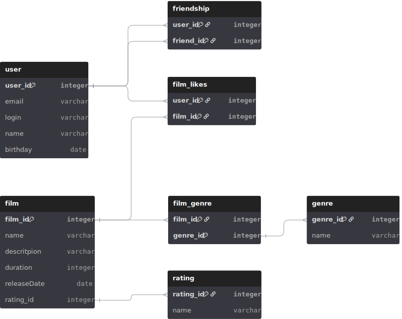

# Java-Filmorate


Приложение для управления фильмами и пользовательскими оценками — от дружбы до любимых жанров.  
Создано, чтобы делиться киномиром с другими и находить идеальные рекомендации.

---

## Описание 🎬

Java-Filmorate — это RESTful-сервис для работы с фильмами и пользователями.  
Пользователи могут добавлять фильмы, ставить оценки, заводить друзей и получать рекомендации.  
Приложение построено на **Spring Boot**, с хранением данных в памяти (в будущем планируется интеграция с базой данных).

---

## Функционал ✨

- Регистрация и управление пользователями 👤
- Добавление и редактирование фильмов 🎥
- Оценка фильмов и система рекомендаций 🌟
- Управление друзьями 🤝
- Категории и жанры фильмов 🏷️

---

## Стек технологий 🛠️

- **Java 17** ☕
- **Spring Boot 3** 🌱
- **Maven** 📦
- **Lombok** ✏️
- **JUnit 5** 🧪

---

## Структура проекта 📂
```text
src/
├─ main/
│ ├─ java/ru/yandex/practicum/filmorate/
│ │ ├─ controller/ # REST-контроллеры
│ │ ├─ model/ # Модели данных
│ │ ├─ storage/ # Репозитории/хранилища
│ │ └─ service/ # Сервисный слой
│ └─ resources/
│ └─ application.properties
└─ test/ # Unit-тесты
```


---

## Запуск проекта ▶️

1. Клонируйте репозиторий:

```bash
git clone https://github.com/N1IKITA2212/java-filmorate.git
```

2. Перейдите в каталог проекта

```bash
cd java-filmorate
```

3. Запустите через **Maven**
```bash
mvn spring-boot:run
```
4. Приложение доступно по адресу http://localhost:8080

## API Эндпоинты

| Метод | URL | Описание | Тело запроса | Ответ |
|-------|-----|----------|--------------|-------|
| GET | `/users` | Получить список всех пользователей | — | JSON-массив пользователей |
| GET | `/users/{id}` | Получить пользователя по ID | — | JSON пользователя |
| POST | `/users` | Добавить нового пользователя | JSON с данными пользователя | JSON созданного пользователя |
| PUT | `/users` | Обновить данные пользователя | JSON с данными пользователя | JSON обновленного пользователя |
| DELETE | `/users/{id}` | Удалить пользователя | — | Статус ответа |
| PUT | `/users/{id}/friends/{friendId}` | Добавить друга | — | JSON пользователя с обновленным списком друзей |
| DELETE | `/users/{id}/friends/{friendId}` | Удалить друга | — | JSON пользователя с обновленным списком друзей |
| GET | `/users/{id}/friends` | Получить список друзей пользователя | — | JSON-массив друзей |
| GET | `/users/{id}/friends/common/{otherId}` | Получить общих друзей с другим пользователем | — | JSON-массив общих друзей |
| GET | `/films` | Получить список всех фильмов | — | JSON-массив фильмов |
| GET | `/films/{id}` | Получить фильм по ID | — | JSON фильма |
| POST | `/films` | Добавить новый фильм | JSON с данными фильма | JSON созданного фильма |
| PUT | `/films` | Обновить фильм | JSON с данными фильма | JSON обновленного фильма |
| DELETE | `/films/{id}` | Удалить фильм | — | Статус ответа |
| PUT | `/films/{id}/like/{userId}` | Поставить лайк фильму | — | JSON фильма с обновленным числом лайков |
| DELETE | `/films/{id}/like/{userId}` | Убрать лайк с фильма | — | JSON фильма с обновленным числом лайков |
| GET | `/films/popular?count={n}` | Получить топ-N популярных фильмов | — | JSON-массив фильмов |

## Тестирование 🧪
Для запуска unit-тестов используйте:
```bash
mvn test
```

---


## 🗄️ Структура базы данных

**Filmorate** использует реляционную базу данных для хранения информации о пользователях, фильмах, жанрах и связях между ними.

### ER-диаграмма базы данных


### Основные таблицы

#### `user`
Хранит данные о пользователях:

- `user_id` *(PK)* — уникальный идентификатор пользователя
- `email` — адрес электронной почты
- `login` — логин пользователя
- `name` — имя
- `birthday` — дата рождения

#### `film`
Хранит данные о фильмах:

- `film_id` *(PK)* — уникальный идентификатор фильма
- `name` — название
- `description` — описание
- `duration` — продолжительность (в минутах)
- `releaseDate` — дата выхода
- `genre_id` *(FK → genre.genre_id)* — жанр
- `rating_id` *(FK → rating.rating_id)* — рейтинг (например, G, PG-13, R)

#### `genre`
Справочник жанров:

- `genre_id` *(PK)* — уникальный идентификатор жанра
- `name` — название жанра

#### `rating`
Справочник возрастных рейтингов:

- `rating_id` *(PK)* — уникальный идентификатор рейтинга
- `name` — обозначение рейтинга (например, “PG-13”)

#### `friendship`
Отражает дружеские связи между пользователями:

- `user_id` *(FK → user.user_id)* — пользователь
- `friend_id` *(FK → user.user_id)* — его друг
- `isAccepted` — подтверждена ли дружба

#### `film_likes`
Фиксирует, какие пользователи поставили лайк фильму:

- `user_id` *(FK → user.user_id)*
- `film_id` *(FK → film.film_id)*

#### `film_genre`
Связь “многие ко многим” между фильмами и жанрами:

- `film_id` *(FK → film.film_id)*
- `genre_id` *(FK → genre.genre_id)*

---

## 💡 Примеры SQL-запросов

### 🎬 1. Получить все фильмы
**Эндпоинт:** `GET /films`  
Возвращает список всех фильмов с жанрами и рейтингами.

```sql
SELECT f.film_id,
       f.name,
       f.description,
       f.releaseDate,
       f.duration,
       g.name  AS genre,
       r.name  AS rating
FROM film f
LEFT JOIN genre g ON f.genre_id = g.genre_id
LEFT JOIN rating r ON f.rating_id = r.rating_id;
```

### 🎥 2. Получить фильм по ID
**Эндпоинт** `GET /films/{id}`
Возвращает полную информацию о фильме по его идентификатору
```sql
SELECT f.film_id,
       f.name,
       f.description,
       f.releaseDate,
       f.duration,
       g.name  AS genre,
       r.name  AS rating
FROM film f
LEFT JOIN genre g ON f.genre_id = g.genre_id
LEFT JOIN rating r ON f.rating_id = r.rating_id
WHERE f.film_id = :id;
```

### 🧑‍🤝‍🧑 3. Получить список друзей пользователя
**Эндпоинт** `GET /users/{id}/friends`
Возвращает всех друзей пользователя
```sql
SELECT u.user_id,
       u.name,
       u.login,
       u.email
FROM friendship fr
JOIN user u ON fr.friend_id = u.user_id
WHERE fr.user_id = :id AND fr.isAccepted = TRUE;
```
---
## Автор
 - **Github:** [Nikita German](https://github.com/N1IKITA2212)